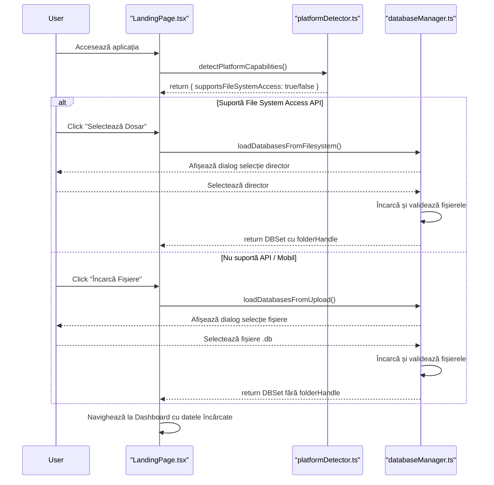

# Arhitectura Fluxului de Date în carapp2

## Introducere

Acest document descrie arhitectura și fluxul logic al operațiunilor de încărcare, procesare și salvare a bazelor de date SQLite în cadrul aplicației **carapp2**. Analiza se bazează pe fișierele TypeScript din directorul `src/services` și `src/logic`, care constituie nucleul managementului de date.

## Arhitectura Generală

Aplicația utilizează o arhitectură duală pentru a gestiona fișierele de baze de date, asigurând atât o experiență modernă pe browserele compatibile, cât și o compatibilitate universală prin metode de fallback.

1.  **Detecția Platformei**: La pornire, aplicația își detectează propriile capabilități, în special suportul pentru **File System Access API**.
2.  **Încărcare Duală**:
    *   **Metoda Preferată (File System Access API)**: Pe Chrome/Edge desktop, utilizatorului i se permite să selecteze un întreg director. Aplicația obține handle-uri persistente către fișiere, permițând citirea și scrierea directă, fără pași intermediari de upload/download.
    *   **Metoda de Fallback (Upload Clasic)**: Pe browsere care nu suportă API-ul (Safari, Firefox, mobile), aplicația revine la un mecanism clasic de `<input type="file">`, unde utilizatorul selectează manual fișierele `.db`.
3.  **Procesare în Memorie**: Indiferent de metoda de încărcare, fișierele binare sunt încărcate în memorie și deschise ca instanțe de baze de date `sql.js` (SQLite compilat în WebAssembly).
4.  **Caching (IndexedDB)**: Pentru a oferi persistență între reîncărcările paginii, bazele de date sunt salvate temporar într-o bază de date IndexedDB. Acest cache este **șters complet** la fiecare nouă încărcare de fișiere pentru a preveni conflictele de versiuni.
5.  **Salvare Duală**: Procesul de salvare este, de asemenea, dual. Pe Chrome/Edge, fișierele sunt suprascrise direct în directorul original. Pe celelalte browsere, fișierele modificate sunt oferite utilizatorului pentru download.

## Componente Cheie

Următoarele fișiere sunt esențiale pentru funcționarea acestui sistem.

### 1. `databaseManager.ts`

| | |
| :--- | :--- |
| **Nume Fișier** | `src/services/databaseManager.ts` |
| **Scop** | Este **orchestratorul central** pentru toate operațiunile cu baze de date. Gestionează încărcarea, validarea, accesul și salvarea, abstractizând complexitatea metodelor duale. |

#### Flux Logic

**Încărcare (`loadDatabasesFromFilesystem` vs. `loadDatabasesFromUpload`):**
1.  **Inițializare**: Așteaptă inițializarea `sql.js`.
2.  **Selecție Metodă**: Verifică existența `window.showDirectoryPicker`.
    *   **DA**: Apelează `loadDatabasesFromFilesystem`.
        1.  Afișează dialogul de selecție a directorului.
        2.  Curăță complet IndexedDB-ul (`clearAllPersistedDatabases`).
        3.  Iterează prin fișierele așteptate (MEMBRII.db, DEPCRED.db, etc.) și le încarcă folosind `loadDatabaseFile`.
        4.  Validează structura fiecărei baze de date încărcate (`validateDatabaseStructure`).
        5.  Returnează un obiect `DBSet` complet, incluzând un `folderHandle` pentru operațiuni viitoare de scriere.
    *   **NU**: Apelează `loadDatabasesFromUpload`.
        1.  Creează un element `<input type="file">` și îl declanșează.
        2.  După ce utilizatorul selectează fișierele, curăță IndexedDB.
        3.  Iterează prin `FileList`, citește fiecare fișier ca `ArrayBuffer`.
        4.  Validează header-ul SQLite.
        5.  Încarcă buffer-ul într-o instanță `sql.js`.
        6.  Verifică prezența tuturor bazelor de date obligatorii.
        7.  Returnează obiectul `DBSet` (fără `folderHandle`).

**Salvare (`persistDatabases`):**
1.  Verifică sursa datelor (`databases.source`).
    *   **`filesystem`**: Utilizează `folderHandle` pentru a apela `saveDatabaseToFilesystem` pentru fiecare bază de date, suprascriind fișierele direct pe disc.
    *   **`upload`**: Apelează `downloadDatabase` pentru fiecare bază de date, declanșând un download individual pentru fiecare fișier în browser.

### 2. `databasePersistence.ts`

| | |
| :--- | :--- |
| **Nume Fișier** | `src/services/databasePersistence.ts` |
| **Scop** | Gestionează **exclusiv cache-ul din IndexedDB**. Acționează ca un strat de persistență temporară pentru a îmbunătăți experiența utilizatorului între reîncărcările paginii. |

#### Flux Logic

-   **`openDB`**: Inițializează conexiunea la IndexedDB și creează object store-ul `databases` dacă nu există.
-   **`clearAllPersistedDatabases`**: Funcție critică. Golește complet object store-ul. Este apelată **înainte** de fiecare nouă încărcare de fișiere pentru a asigura că aplicația lucrează mereu cu date "proaspete", prevenind conflictele.
-   **`persistDatabase`**: Primește o instanță de bază de date `sql.js`, o exportă ca `Uint8Array` și o salvează în IndexedDB sub un nume specific.
-   **`loadPersistedDatabase`**: Citește un `Uint8Array` din IndexedDB și îl folosește pentru a reconstitui o instanță `sql.js`.

### 3. `platformDetector.ts`

| | |
| :--- | :--- |
| **Nume Fișier** | `src/services/platformDetector.ts` |
| **Scop** | Un utilitar simplu, dar esențial, care inspectează `navigator` și `window` pentru a determina capabilitățile browserului curent. |

#### Flux Logic

-   Detectează numele browserului, platforma (iOS, etc.), statusul PWA și, cel mai important, `supportsFileSystemAccess`.
-   Valoarea `supportsFileSystemAccess` este folosită în `databaseManager.ts` pentru a alege între `showDirectoryPicker` și fallback-ul la upload.

### 4. `dbLoader.ts` (Logic Vechi)

| | |
| :--- | :--- |
| **Nume Fișier** | `src/logic/dbLoader.ts` |
| **Scop** | Reprezintă o versiune mai veche a logicii de încărcare, orientată spre `fetch`-uirea bazelor de date dintr-un director public. Deși nu mai este metoda principală de interacțiune cu utilizatorul, logica sa de detecție a conversiei EUR (`detectDualCurrency`) și de încărcare secvențială este încă relevantă. |

#### Flux Logic

-   **`detectDualCurrency`**: Încearcă să găsească un fișier `dual_currency.json` sau fișiere cu sufix `_EUR.db` pentru a determina dacă aplicația trebuie să opereze în modul de conversie valutară.
-   **`loadDb`**: Încarcă o singură bază de date prin `fetch`, gestionând posibilele sufixe (ex: `_EUR`).
-   **`loadAllDbs`**: Orchestrează încărcarea secvențială a tuturor bazelor de date necesare.

## Diagrama Fluxului de Încărcare

## Concluzie

Arhitectura de management a datelor din **carapp2** este robustă și flexibilă. Prin combinarea **File System Access API** cu un fallback universal și un strat de caching inteligent prin **IndexedDB**, aplicația oferă o experiență de utilizare modernă, fără a sacrifica compatibilitatea. Fișierul `databaseManager.ts` este piesa centrală care asigură coerența și buna funcționare a acestui sistem complex.
